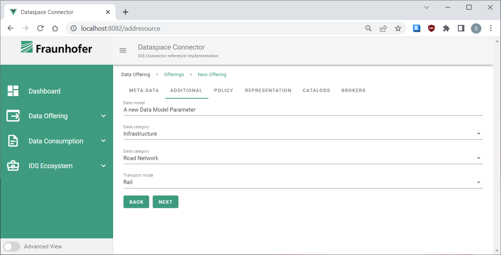

## Dataspace Connector UI

User interface for the [Dataspace Connector](https://github.com/International-Data-Spaces-Association/DataspaceConnector).

The following illustration visualizes the interaction of the [Dataspace Connector](https://github.com/International-Data-Spaces-Association/DataspaceConnector), the [IDS Messaging Services](https://github.com/International-Data-Spaces-Association/IDS-Messaging-Services), the Configuration Manager, and it’s GUI. All components have a defined API that allows individual components to be removed or replaced. The Dataspace Connector can be deployed standalone and can be connected to existing backend systems. Configuration Manager and GUI facilitate the operation and configuration of the connector. If desired, the Dataspace Connector may be replaced by another connector implementation, either integrating the IDS Messaging Services or not.


## Requirements
* Install and start [Dataspace Connector](https://github.com/International-Data-Spaces-Association/DataspaceConnector)
* Install [Node.js v.14](https://nodejs.org/en/download/)

## Installation

Use the package manager [npm](https://nodejs.org/en/download/) in root directory to install DataspaceConnector UI:

```bash
npm install --no-audit
```

## Usage

### Start Dataspace Connector UI
Use the package manager [npm](https://nodejs.org/en/download/) in root directory to start Dataspace Connector UI:
```bash
npm start
```
Access: [localhost:8082](http://localhost:8082) 

### Change UI port

Change `package.json` in root directory:
```bash
"serve": "vue-cli-service serve --open --port [PORT]"
```

### Change Dataspace Connector host & port

Change in `src/backend/index.js`:
```bash
let connectorUrl = "https://localhost:8080"
```

### Change theme

You can change the main colors of the user interface in `src/theme/default.js`

### Protect backend with Basic Auth
If you need to protect the website via Basic Auth, you can adjust the username and password via environment variables of the backend, simply by adjusting the `src/backend/.env` file or by setting the environment variables in your Docker environment.
To activate the protection, you need to provide a username and a password, both with a length > 0. Otherwise (default behaviour), it is inactive.
```
BASIC_AUTH_USER=username
BASIC_AUTH_PASSWORD=password
```

### Test backend

The UI backend provides an endpoint (http://[localhost:8083]/testdata) that can be used as backend connection (type: REST) in the DSC for testing purposes.
This can process POST and GET requests.

## Start with Docker

Build docker image:
```bash
sudo docker build -t dataspace-connector-ui .
```
Run docker image:
```bash
sudo docker-compose up
```
Access: [localhost:8083](http://localhost:8083) 

### Change host/port & authentification of Dataspace Connector on docker start

Change in `docker-compose.yml`:
```bash
environment:
          - CONNECTOR_URL=https://localhost:8080
          - CONNECTOR_USER=testuser
          - CONNECTOR_PASSWORD=testpw
```

## Add custom attributes to Resources
The Dataspace Connector allows to define additional attributes for each of its entities (see [Dataspace Connector Documentation](https://international-data-spaces-association.github.io/DataspaceConnector/Documentation/v6/DataModel). If the additional fields are set for a `Resource` entity, this information can be used to provider further metadata, e.g. for registering these data at an IDS Metadata Broker (which must support these Metadata-fields too). The Dataspace Connector UI provides the functionality to define custom fields, which are shown in the frontend to define such additional information on a Resource level (see Screenshot below). By default the functionality is disabled and thus not shown in the UI.



You can define additional elements via three input options: 
- text fields
- select boxes (e.g., a category)
- select boxes with according sub-select boxes (e.g., category with sub-categories) 

### Enable and adjust the configuration
To enable the feature, go to the backend folder `src/backend/` and adjust `.env` file: `USE_ONTOLOGY = true`. In case you are deploying the frontend via Docker set environment variables accordingly. The processing of the feature takes place in `ontologyLoader.js`. A demo configuration is already given by the files `src/backend/ontology.ttl` and `src/backend/ontology.config.json`.

#### Adjust the ontology
You need to adjust the content of the file `src/backend/ontology.ttl`, which already provides some examples.

##### Select boxes
For select boxes, you have to define an `owl:class` element:
```
dsc:DataCategory 
    a owl:Class ;
    rdfs:label "Data category"@en ;
    rdfs:comment "Class of all data categories."@en .
                 
dsc:dataCategory 
    a owl:ObjectProperty ;
    rdfs:domain ids:Resource ;
    rdfs:range dsc:DataCategory ;
    rdfs:label "Data category"@en .
```

If you want to define a select box with a sub-select box, in addition you need to add (do not forget to link the elements of the class to this sub-category (see below)):
```
dsc:DataSubcategory 
    a owl:Class ;
    rdfs:label "Data subcategory"@en ;
    rdfs:comment "Class of all data subcategories."@en .
                    
dsc:dataSubcategory 
    a owl:ObjectProperty ;
    rdfs:domain ids:Resource ;
    rdfs:range dsc:DataSubcategory ;
    rdfs:label "Data subcategory"@en .
```

To add categories to the root select box, simply add elements referring to the class:
```
cat:Infrastructure 
    a dsc:DataCategory ;
    rdfs:label "Infrastructure"@en .
```

To add elements for sub-select boxes, add them accordingly: 
```
sub:RoadNetwork 
    a cat:Infrastructure ;
    rdf:type   dsc:DataSubcategory ;
    rdfs:label "Road Network"@en .
```

##### Text fields
For text fields, you have to define an `owl:DatatypeProperty` element:
```
dsc:dataModel 
    a owl:DatatypeProperty ;
    rdfs:domain ids:Resource ;
    rdfs:range rdfs:Literal ;
    rdfs:label "Data model"@en .
```

#### Customizing
In case you cannot stick to the given ontology, you may change the static variables for predicates and objects to identify the structure of the given ontology in `ontologyLoader.js`. 

#### Adjust the configuration `ontology.config.json`
In order to map and display the additional fields, you need to adjust the configuration file. Each select box needs to be defined as object in `select` array, and text fields need to be defined as objects in `text` array.
```
{
  "select":[
    {...}, ..., {...}
  ],
  "text":[
    {...}, ..., {...}
  ]
}
```

#### Select box configuration
You need to define four properties on each object:
- `"identifier": string`: The identifier of the ontology class for a select box, e.g. `http://w3id.org/dsc#DataCategory`. This identifier is used to analyze the structure of your ttl file. Be aware that this identifier is overwritten within the process of parsing, as the expected key needs to be a parameter instead of a class. Thus, in this example `http://w3id.org/dsc#dataCategory` would be the key (notice the lower case `d`)
- `"required": boolean`: If it is required to select an option from the select box.
- `"identifier_children": string`: The identifier of the ontology class for a sub-select box, e.g. `http://w3id.org/dsc#DataSubcategory`. This field is not used for parsing. It is just used for the front-end to determine the correct key for the selected value.
- `"required_children": boolean`: If it is required to select an option from the sub-select box.

#### Text field configuration
You need to define two properties on each object:
- `"identifier": string`: The identifier of the ontology class for a text field, e.g. `http://w3id.org/dsc#dataModel`.
- `"required": boolean`: If it is required to enter text in the text field.


## Development
Please read the [development guide](https://github.com/International-Data-Spaces-Association/DataspaceConnectorUI/blob/develop/DEVELOPMENT_GUIDE.md).


## Contributing
Please read through our [contributing guidelines](https://github.com/International-Data-Spaces-Association/DataspaceConnectorUI/blob/develop/CONTRIBUTING.md).

### Main Contact
[Sebastian Opriel](https://github.com/SebastianOpriel), [sovity GmbH](https://sovity.de)

### Contributors
* [Bastian Wetljen](https://github.com/BastianWel), [Fraunhofer FKIE](https://www.fkie.fraunhofer.de)
* [Sebastian Opriel](https://github.com/SebastianOpriel), [sovity GmbH](https://sovity.de)
* [Melissa Das](https://github.com/melissadas), [sovity GmbH](https://sovity.de)
* [Philipp Reusch](https://github.com/pdrd), [sovity GmbH](https://sovity.de)